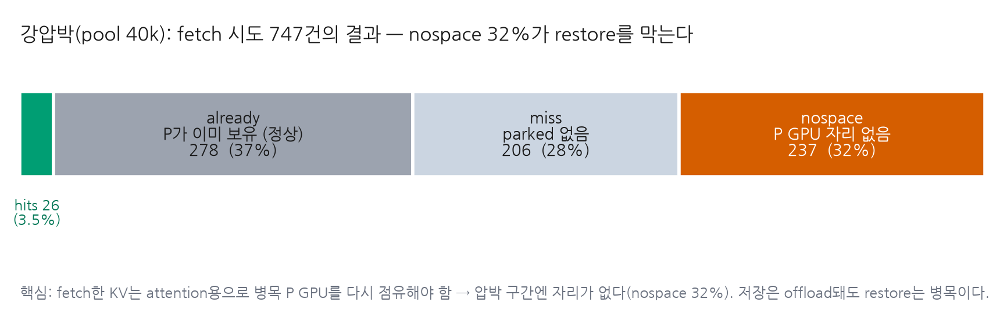

# Idle KV Parking — Phase 1 결과 보고

**주제**: PD(prefill–decode) disaggregation의 multi-turn agent 워크로드에서, tool-call 유휴시간에
decode 노드의 세션 KV를 **유휴 GPU에 park 했다가 다음 turn에 fetch**해 재계산(re-prefill)을
피할 수 있는가?

> **결론(TL;DR)**: fetch-on-hit까지 end-to-end로 구현·측정한 결과, **이 2×A6000 단일 노드에선
> 어떤 압박 수준에서도 park+fetch가 baseline(radix = GPU prefix cache)을 이기지 못했다.** 원인은 구현
> 디테일이 아니라 구조적 **catch-22**: 파킹이 이득을 주는 조건(압박→축출)과 fetch한 KV를 되돌릴
> 자리가 있는 조건(여유)이 **동시에 성립하지 않는다.** 저장은 유휴 자원으로 offload되지만
> **restore는 병목(P GPU)을 다시 점유**해야 하기 때문이며, 이는 인터커넥트(NVLink) 속도와
> 무관한 토폴로지-독립적 한계다.

---

## 1. 배경과 가설

- **문제**: 압박 하에서 P 노드의 prefix(radix) 캐시가 대화 중간에 축출되면, 이후 모든 turn이
  전체 history를 **재계산**해 TTFT가 폭증한다.
- **아이디어**: D→P 노드(또는 유휴 GPU)로 세션 KV를 park 했다가, tool-call이 끝나 다음 turn이
  올 때 fetch해 prefix-hit으로 재사용 → 재계산 회피.
- **검증 가설**: "PCIe로 fetch해도 재계산보다 빠르다."

## 2. 실험 설정

- 하드웨어: server17, A6000×4 (NVLink 쌍 (0-1),(2-3)), Llama-3.1-8B, SGLang 0.5.9 + Mooncake.
- 구성: **1P1D** (P=GPU0, D=GPU1) + **전용 park 풀 GPU2**(200k tok). 벤치: BFCL v3 multi-turn
  200 items, 동시성 8, tool-call 유휴 3s.
- 구현(SGLang): D→P **CUDA IPC + P2P** 채널, turn 종료 시 프롬프트 KV park, 다음 요청 prefill 직전
  `maybe_fetch()`가 최장 parked prefix를 GPU2→GPU0 복사 + radix insert → prefix-hit.
- 3-arm 비교: **radix**(GPU RadixAttention prefix cache — recovery tier 없음) /
  **hicache**(host-DRAM fetch) / **park**(GPU2 fetch, 본 연구). P GPU 풀 크기(=압박)를 40k→120k 스윕.

> **주의 — radix는 "재계산 baseline"이 아니다.** radix도 RadixAttention prefix cache라 GPU에
> 남아있는 prefix는 hit한다(reuse 0.39~0.74). radix가 recompute하는 건 **hit하지 못한 토큰뿐**:
> ① 매 turn 새로 생기는 토큰(새 user 메시지 + tool 결과, **어떤 캐시도 못 피하는 ~26% floor**) +
> ② **압박으로 축출된 prefix**. parking/hicache가 fetch로 회피하려는 대상은 **②뿐**이며, ②는
> 강압박(pool 40k)에서만 존재한다(pool≥60k에선 축출이 없어 radix reuse가 이미 hicache와 동일 0.74).

## 3. 결과

### Figure 1 — 압박 스윕: catch-22

- **상단(reuse)**: 강압박(pool 40k)에서만 radix가 축출을 겪어 reuse가 0.39로 떨어지고 hicache
  (0.74)와 격차가 벌어진다 = **회수 여지가 있는 유일한 구간**. pool≥60k에선 축출이 없어 세 방식이
  모두 reuse 0.74로 **수렴** = 회수할 대상이 없다. **park의 reuse는 모든 구간에서 radix와 동일.**
- **하단(TTFT)**: **park ≈ radix 전 구간** — fetch가 순 TTFT 이득을 못 만든다. hicache는 강압박
  (40k)에서만 이기고(−25%), 저압박에선 오히려 radix보다 느리다(순수 오버헤드).

### Figure 2 — 강압박에서 fetch가 막히는 이유

강압박(pool 40k) DIAG: fetch 시도 747건 중 성공은 **26건(3.5%)뿐**. 가장 큰 벽은 **nospace 32%**
— fetch한 KV는 attention이 읽으려면 **압박받는 P GPU 풀에 다시 들어가야** 하는데, 그 구간엔 자리가
없어 alloc 실패. (already 37%는 P가 아직 보유해 fetch 불필요한 정상 케이스.)

## 4. Catch-22 (핵심)

| 조건 | 성립 구간 | 문제 |
|---|---|---|
| 파킹이 **가치 있다** (축출→재계산 발생) | 강압박 (pool 40k) | 여기선 restore가 **자리 없음** (nospace 32%) |
| restore할 **자리가 있다** (P 여유) | 저압박 (pool ≥60k) | 여기선 축출이 없어 **회수 대상 없음** (reuse 이미 0.74) |

→ 두 조건이 **공존하지 않으므로**, park이 radix를 이기는 operating point가 존재하지 않는다.

**근본 이유**: 저장(park)은 유휴 GPU로 offload되지만, **fetch한 KV는 attention 연산을 위해 병목인
P GPU 풀을 다시 점유**해야 한다. 이 restore-병목은 **전송 속도(NVLink든 PCIe든)와 무관** —
토폴로지-독립적이다. hicache가 강압박에서 이기는 유일한 이유는 같은 제약을 **evict-to-room + async
prefetch**로 관리하기 때문이며, park을 그 수준으로 엔지니어링해도 이 토폴로지선 GPU2→GPU0가
PCIe(host-DRAM와 동속)·용량 26GB<125GB라 **hicache 재현이 상한, 초과 불가**.

## 5. 결론과 시사점

- **"PCIe fetch > recompute"는 reuse 레벨에선 참**(park reuse 0.39→0.45)이나, 그 이득이 실현되는
  강압박 구간은 정확히 restore 자리가 없는 구간이라 **순 TTFT 이득은 0**.
- idle-KV-parking은 **단일 노드·단일 GPU-tier 환경에선 hicache가 이미 상한**이다.
- **실익이 나려면**: (1) attention이 원격 KV를 직접 읽어 restore가 P GPU를 점유하지 않아도 되는
  **disaggregated / remote attention**, 또는 (2) host DRAM이 유일 로컬 tier이고 원격 GPU 합산
  용량이 host를 압도하는 **진짜 multi-node**.
- 구축한 파이프라인(CUDA IPC/P2P · park · fetch-on-hit)은 위 환경의 재사용 자산으로 보존.

---

### 부록 — 측정 수치 (BFCL, C=8, tool-delay 3s, 200 items)

| pool | radix TTFT / reuse | hicache TTFT / reuse | park TTFT / reuse | park vs radix |
|---|---|---|---|---|
| 40,000 (강압박) | 1.83s / 0.39 | 1.38s / 0.74 | 1.83s / 0.45 | +0.2% |
| 60,000 | 1.27s / 0.74 | 1.38s / 0.74 | 1.19s / 0.74 | −6.3%\* |
| 80,000 | 1.17s / 0.74 | 1.38s / 0.75 | 1.19s / 0.74 | +1.0% |
| 120,000 | 1.15s / 0.74 | 1.27s / 0.75 | 1.15s / 0.74 | +0.4% |

\* pool-60k의 −6.3%는 radix-60k TTFT outlier에 의한 착시(reuse 동일 → fetch 무의미). 노이즈.

강압박 park DIAG: `FETCH hits=26 already=278 miss=206 nospace=237 (of 747), avg 235.8ms`.

*재현*: `POOLS="60000 80000 120000" ./scripts/sglang/run_head_to_head_pool_sweep.sh` →
`benchmark/plot_phase1_catch22.py` (그림). 상세 로그: `phase1.md`, `research.md` §2.16,
SGLang `docs/developer_guide/idle_kv_parking_design.md` §9–§11.
