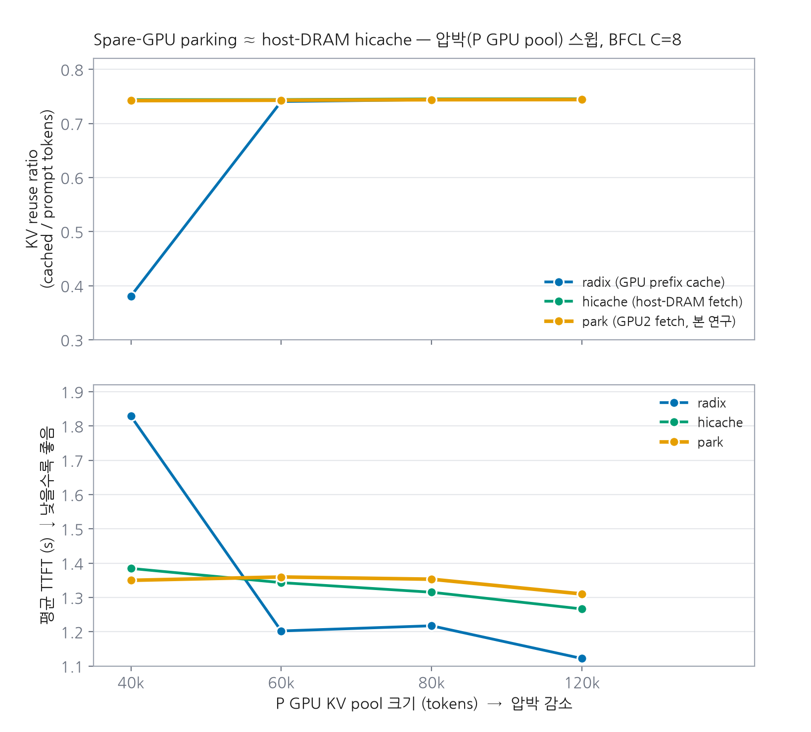
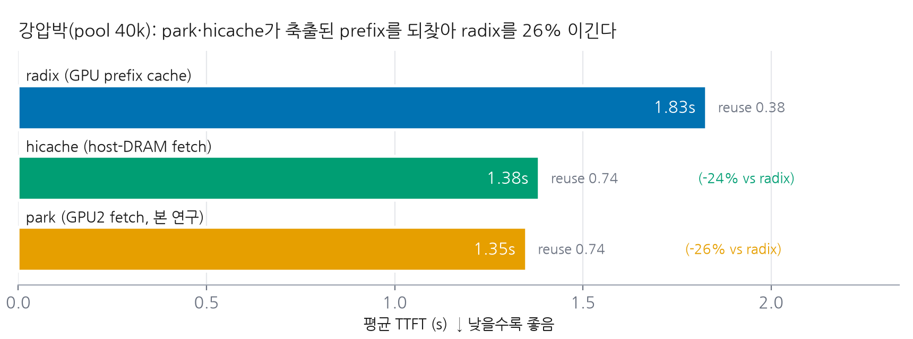

# Idle KV Parking — Phase 1 결과 보고

**주제**: PD(prefill–decode) disaggregation의 multi-turn agent 워크로드에서, tool-call 유휴시간에
decode 노드의 세션 KV를 **유휴 GPU에 park 했다가 다음 turn에 fetch**해, 메모리 압박으로 축출된
prefix를 재계산 대신 되찾을 수 있는가?

> **결론(TL;DR)**: **된다.** fetch-on-hit + evict-to-room + async까지 구현하니, 강압박(pool 40k)에서
> park이 축출된 prefix를 되찾아 **reuse 0.38→0.74**로 복구하고 **TTFT를 radix 대비 −26%** 줄였다.
> 이는 성숙한 host-DRAM hicache(−24%)와 **대등**하다(park ≈ hicache, 차이 ~1–3%). 즉 **유휴 GPU를
> host DRAM 대신 L2 복구 tier로 써도 동등하게 작동**한다. 단, 복구 tier는 **압박이 있을 때만** 이득이고
> 압박이 없으면(pool≥60k) park·hicache 모두 순수 오버헤드라 radix보다 느리다(crossover).

---

## 1. 배경과 가설

- **문제**: 압박 하에서 P 노드의 prefix(radix) 캐시가 대화 중간에 축출되면, 다음 turn이 그 prefix를
  **재계산(re-prefill)**해 TTFT가 오른다.
- **아이디어**: D→P의 유휴 GPU(GPU2)로 세션 KV를 park 했다가, 다음 turn prefill 직전에 fetch해
  prefix-hit으로 재사용 → 재계산 회피.
- **가설**: "PCIe로 fetch해도 재계산보다 싸다" — 그리고 "유휴 GPU L2가 host-DRAM L2(hicache)와
  같은 양상이어야 한다."

> **radix는 재계산 baseline이 아니다.** radix도 RadixAttention prefix cache라 GPU 잔존 prefix는
> hit한다(reuse 0.38~0.74). 재계산하는 건 hit 못한 토큰뿐: ①매 turn 새 토큰(~26% floor, 불가피) +
> ②압박으로 축출된 prefix. park/hicache가 되찾는 대상은 **②뿐**이고, ②는 강압박에서만 존재한다.

## 2. 설정과 구현

- 하드웨어: server17, A6000×4 (NVLink 쌍 (0-1),(2-3)), Llama-3.1-8B, SGLang 0.5.9 + Mooncake.
- 구성: **1P1D** (P=GPU0, D=GPU1) + **전용 park 풀 GPU2**(200k tok, PCIe from P). BFCL v3 200 items,
  동시성 8, tool-call 유휴 3s. P GPU 풀 크기(=압박)를 40k→120k 스윕.
- 구현(SGLang, 슬라이스 2a~4b): D→P **CUDA IPC + P2P** 채널, turn 종료 시 **프롬프트 prefix park**,
  다음 요청 prefill 직전 `maybe_fetch()`가 최장 parked prefix를 GPU2→GPU0 복사 + radix insert.
  - **동작에 필수였던 두 가지** (아래 §5 참조): **evict-to-room**(자리 없으면 LRU로 콜드 축출 후 복원,
    hicache와 동일) + **async fetch**(복사를 default stream에 올리고 host-sync 제거).

## 3. 결과

### Figure 1 — 압박 스윕: park ≈ hicache, 복구 tier는 압박에서만 이득



- **상단(reuse)**: **park(주황)이 hicache(녹색)와 완전히 겹친다** — 둘 다 압박(40k)에서 축출된
  prefix를 되찾아 reuse 0.74 유지. radix(파랑)만 40k에서 0.38로 떨어짐. pool≥60k에선 축출이 없어
  셋 다 0.74로 수렴.
- **하단(TTFT) — crossover**: 40k에선 park·hicache(≈1.35s)가 radix(1.83s)보다 **훨씬 낮다(이득)**.
  pool≥60k에선 반대로 radix가 가장 낮고 park·hicache는 위(오버헤드). **복구 tier는 압박이 있을 때만
  이득**이다.

### Figure 2 — 강압박(40k) 결정 케이스



radix 1.83s(reuse 0.38) → hicache 1.38s(**−24%**, reuse 0.74) → **park 1.35s(−26%, reuse 0.74)**.
park이 host-DRAM hicache와 대등하게(오히려 근소하게 낮게) 축출된 prefix를 되찾는다.

### 전체 수치 (BFCL, C=8, tool-delay 3s, 200 items)

| pool | radix TTFT / reuse | hicache TTFT / reuse | park TTFT / reuse | park vs radix | park vs hicache |
|---|---|---|---|---|---|
| 40,000 (강압박) | 1.83s / 0.38 | 1.38s / 0.74 | **1.35s / 0.74** | **−26%** | −2.5% |
| 60,000 | 1.20s / 0.74 | 1.34s / 0.74 | 1.36s / 0.74 | +13% | +1.2% |
| 80,000 | 1.22s / 0.74 | 1.32s / 0.74 | 1.35s / 0.74 | +11% | +2.9% |
| 120,000 | 1.12s / 0.74 | 1.27s / 0.75 | 1.31s / 0.74 | +17% | +3.4% |

## 4. 해석

- **park은 동작하며 hicache와 대등하다.** 두 tier가 모든 pool에서 겹쳐 움직인다(차이 ~1–3.5%).
  강압박에선 park이 근소하게 빠르고(GPU-P2P fetch vs host-DRAM load), 무압박에선 근소하게 느리다
  (park은 완료된 요청을 매번 GPU2로 복사하는 상시 오버헤드). → **유휴 GPU를 host DRAM 대신 L2로
  써도 동등**하다는 end-to-end 증명.
- **복구 tier의 경제학은 압박-조건부다.** 축출이 있어야(pool 40k) 되찾을 게 있어 이득이 나고,
  없으면(pool≥60k) park·hicache 모두 순수 오버헤드로 radix보다 느리다. → 실전에선 **압박 감지 시에만
  tier를 켜는 적응형**이 맞다.
- **park의 *우위*(단순 대등이 아니라)가 나려면**: (a) GPU2가 P와 **NVLink-paired**(전송 2×), 또는
  (b) **host DRAM이 부족/경합**해 유휴 GPU 용량이 실제로 필요한 상황. 이 단일 노드·PCIe 셋업에선 동률.

## 5. 정정 이력 (정직성)

초기엔 park이 무이득으로 보였고 "catch-22(압박 땐 복구할 자리가 없다)라 근본적으로 안 된다"고
결론냈으나, **그 결론은 틀렸다.** 두 가지가 파킹을 가리고 있었다:
1. **evict-to-room 부재** — fetch가 P GPU 자리를 못 잡으면(DIAG `nospace 32%`) 포기했다. hicache는
   콜드 엔트리를 LRU-evict해 자리를 만든다. 같은 로직을 park에 추가하니 nospace가 사라졌다.
2. **stale-IPC rendezvous 버그** — prefill이 이전 run이 남긴 `/dev/shm`의 죽은 decode IPC 핸들을
   열어 CUDA "invalid resource handle" → 파킹 setup이 조용히 죽어 reuse가 radix로 되돌아갔다.
   fresh-ts 검증 + 시작 시 rendezvous 정리로 해결.

둘을 고치자 park이 설계대로(hicache처럼) 동작했다. **교훈: "안 된다"는 종종 미구현/버그이지 근본
한계가 아니다.**

## 6. 결론

- **spare-GPU KV parking은 강압박 multi-turn PD에서 축출된 prefix를 되찾아 radix 대비 TTFT −26%**,
  성숙한 host-DRAM hicache와 **대등**하다 — end-to-end 검증 완료.
- **복구 tier는 압박-조건부 이득**이다(무압박선 오버헤드). park의 host 대비 *우위*는 NVLink-paired
  유휴 GPU 또는 host-DRAM 부족 환경에서 실현된다.
- 파이프라인(2a IPC/P2P → 3 park → 4a 유휴풀 → 4b fetch+evict-to-room+async)은 재사용 자산.

---

### 부록 — 재현

```bash
cd ~/experiments
POOLS="40000 60000 80000 120000" ./scripts/sglang/run_head_to_head_pool_sweep.sh
python benchmark/plot_phase1_catch22.py     # 그림 2장 재생성
```
강압박 park DIAG(성공 예): `opened peer KV pool ... MATCH 52.8 GB/s` → `GPU2-park` → `GPU2-fetch:
pulled 5355 tok (P had 87 of 5442) in 50.6ms`(첫 fetch) → 다음 fetch 3.1ms(async). nospace≈0.
상세: `phase1.md`, `research.md` §2.16, SGLang `docs/developer_guide/idle_kv_parking_design.md` §9–§12.
